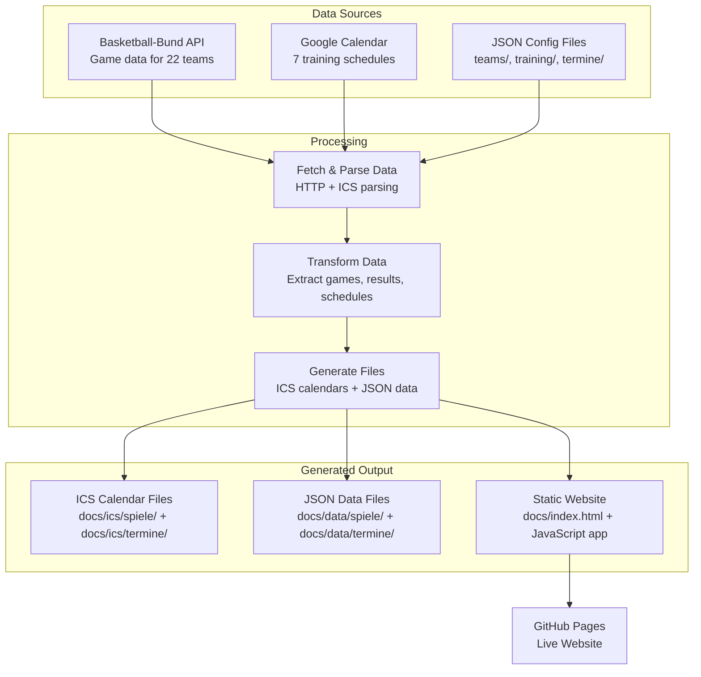

# BC Lions Moabit Calendar System

Automated basketball team calendar system that generates dynamic game schedules and training calendars for BC Lions Moabit basketball club.

## Data Flow



## Tech Stack

- **Runtime:** Node.js 18+ (ES Modules)
- **APIs:** Basketball-Bund REST API, Google Calendar API  
- **Testing:** Vitest (279 tests, 100% pass required)
- **Architecture:** Service-oriented with dependency injection
- **Output:** Static HTML + ICS files + JSON data

## Build Commands

```bash
npm ci                    # Install dependencies
npm test                 # Run all tests
npm run build           # Full build (games + calendars + HTML)
npm run build:calendars # Calendars only (~30s)
npm run build:games     # Games only (~2min)  
npm run build:html      # HTML only (fast)
```

## GitHub Actions

### Automatic: Daily at 10:00 UTC (full update)

### Manual Triggers: [Actions Tab](https://github.com/pkcpkc/bc-lions-moabit/actions)

| Button | Duration | Updates |
|--------|----------|---------|
| 🔄 **Full Update** | ~3min | Games + Calendars + HTML |
| 📅 **Calendars Only** | ~30s | Training schedules only |
| 🏀 **Games Only** | ~2min | Game results only |

**Usage:** Actions → "Update BC Lions Moabit Data" → "Run workflow" → Choose type