# BC Lions Moabit - Dynamic Calendar System

This system automatically generates basketball team calendars and training schedules with client-side dynamic rendering. It fetches game data from basketball-bund.net and integrates with Google Calendar for training schedules, generating both ICS calendar files and a responsive HTML page with dynamic sections.

## Architecture

- **Client-Side Rendering**: HTML page dynamically creates team and training sections using JavaScript
- **Template**: `index.template.html` - Static template with dynamic placeholders
- **Builder**: `build-html.js` - Generates HTML with embedded JSON configurations for teams and training
- **Fetcher**: `fetch-games.js` - Downloads games and generates ICS files with team prefixes
- **Configurations**: 
  - `teams/*.json` files with explicit team IDs for game schedules
  - `termine/*.json` files with Google Calendar IDs for training schedules

## Script Execution Flow

The following diagram shows how the scripts work together in the build process:

```mermaid
graph TD
    A[🚀 build.js<br/>Main Orchestrator] --> B[📥 fetch-all.js<br/>Process All Teams]
    A --> C[🗓️ download-termine.js<br/>Download Training Calendars]
    A --> D[🔨 build-html.js<br/>Generate Final HTML]
    
    B --> E[📊 fetch-games.js<br/>Individual Team Processing]
    E --> F[🏀 basketball-bund.net API<br/>Fetch Game Data]
    E --> G[📝 Generate ICS Files<br/>docs/ics/spiele/*.ics]
    
    C --> H[📅 Google Calendar API<br/>Download Training ICS]
    C --> I[📝 Save Training ICS<br/>docs/ics/termine/*.ics]
    
    D --> J[📋 Read teams/*.json<br/>Team Configurations]
    D --> K[📋 Read termine/*.json<br/>Training Configurations]
    D --> L[🎯 Generate docs/index.html<br/>Final Website]
    
    M[🔍 crawl.js<br/>Team Discovery] -.-> N[📝 Create teams/*.json<br/>Auto-generate Configs]
    N -.-> J
    
    style A fill:#e1f5fe
    style B fill:#f3e5f5
    style C fill:#e8f5e8
    style D fill:#fff3e0
    style M fill:#fce4ec
```



**Script Dependencies:**
- `build.js` → `fetch-all.js` → `fetch-games.js` (parallel execution)
- `build.js` → `download-termine.js` (parallel with fetch-all.js)
- `build.js` → `build-html.js` (after data collection)
- `crawl.js` → Independent discovery tool (optional)

## Configuration Format

### Team Configurations (`teams/*.json`)

Each team JSON config file should contain:

```json
{
    "teamId": "u12",
    "competitionId": "50422",
    "teamName": "BC Lions Moabit 1 mix"
}
```

- **teamId**: Unique identifier for the team (used for prefixes and file generation)
- **competitionId**: The ID from the basketball-bund.net website
- **teamName**: The exact team name to filter for

**Note**: ICS filename is automatically generated as `docs/ics/spiele/${teamId}.ics`

### Termine Configurations (`termine/*.json`)

Each termine JSON config file should contain:

```json
{
    "label": "BC Lions Boys",
    "calId": "6f946bc99a6785308b4facc586f3f865fbdc24c3dee6fbd779848d459d645cf3@group.calendar.google.com"
}
```

- **label**: Display name for the schedule group
- **calId**: Google Calendar ID for the training schedule

**Note**: Schedule calendars use Google Calendar embeds and automatic iCal generation

## Usage

### Complete Build (Recommended)
```bash
# Full build process: fetch games, download termine, generate HTML
npm run build
# or
node build.js
```

This is the **recommended workflow** as it ensures your HTML page has the latest data by automatically running:
1. **Fetch games** for all configured teams
2. **Download termine ICS files** from Google Calendar  
3. **Generate HTML** with updated data

The termine ICS files are downloaded only once per build cycle, improving efficiency.

### Individual Operations
```bash
# Fetch games for all configured teams in parallel (without HTML generation)
npm run fetch-all

# Download termine ICS files from Google Calendar
npm run download-termine
# or
node download-termine.js

# Fetch games for a specific team (without HTML generation)
node fetch-games.js u11.json
node fetch-games.js u12.json
node fetch-games.js u15.json    # Works with any team config file

# Generate HTML only (with current data)
npm run build-html
# or
node build-html.js
```

### Team Discovery
```bash
# Auto-discover all BC Lions teams from basketball federation
npm run crawl
# or 
node crawl.js
```

**Note**: The crawl script automatically discovers all BC Lions teams registered in Berlin basketball leagues and creates configuration files. It uses parallel processing to investigate all leagues simultaneously, significantly improving performance over sequential processing.

## GitHub Actions (Automated Updates)

The repository includes a GitHub Action for automated termine updates and HTML rebuilding. This allows you to update the website directly from GitHub.com without local development setup.

### Manual Execution

1. **Navigate to Actions Tab**: Go to your repository on GitHub.com → Actions tab
2. **Select Workflow**: Click "Update Termine and Build HTML" from the workflow list
3. **Run Workflow**: Click "Run workflow" button
4. **Optional Force Update**: Check "Force update" to commit changes even if no changes are detected

### What the Action Does

The GitHub Action performs these steps:
1. **Setup Environment**: Installs Node.js 18 and project dependencies
2. **Download Termine**: Runs `download-termine.js` to fetch latest training calendars from Google Calendar
3. **Build HTML**: Runs `build-html.js` to regenerate the website with updated data
4. **Auto-Commit**: Automatically commits and pushes changes if updates are detected
5. **Summary Report**: Provides execution summary in the GitHub Actions interface

### Benefits

- **No Local Setup Required**: Update calendars directly from GitHub.com
- **Automatic Deployment**: Changes are immediately visible on GitHub Pages (if configured)
- **Smart Updates**: Only commits when actual changes are detected
- **Audit Trail**: All updates tracked in git history with timestamps
- **Manual Control**: Trigger updates on-demand when needed

### Workflow File

The action is defined in `.github/workflows/update-termine.yml` and can be customized as needed.

## Execution Patterns

### Parallel Processing Architecture
The system uses aggressive parallelization for maximum performance:


**Performance Benefits:**
- **Team Level**: All 22 teams processed simultaneously
- **Match Level**: Individual team's matches fetched in parallel
- **Calendar Level**: All 7 training calendars downloaded concurrently
- **Total Build Time**: ~13-35 seconds for 424 games across 22 teams

## How It Works

### Server-Side (Build Time)
1. **build-html.js** scans `teams/*.json` files and embeds their configuration as JSON in the HTML template
2. **fetch-games.js** fetches games from basketball-bund.net API and generates ICS files with team ID prefixes (e.g., `u11: Team A vs Team B`)

### Client-Side (Runtime) 
3. JavaScript dynamically creates:
   - **Übersicht**: Main navigation (Alle Termine, Jugendfahrplan, Anleitung)
   - **Spielpläne**: Team calendar sections with download/subscribe buttons and event previews
   - **Training**: Google Calendar embedded views with subscription options
4. Three-section navigation layout with condensed, organized UI

## Key Features

### Team ID Prefixes in Calendar Entries
All calendar entries are prefixed with the team ID for easy identification:
- `u11: BC Lions Moabit 1 mix vs Team X (Venue)`
- `u12: Team Y vs BC Lions Moabit 1 mix (Venue)`

### Optimized Performance
- **Dual-Level Parallelization**: 
  - **Team-level**: All teams processed concurrently (`fetch-all.js`)
  - **Match-level**: All match details fetched concurrently per team (`fetch-games.js`)
- **Dramatic Speed Improvements**: 
  - Complete build: ~36 seconds (vs. ~10+ minutes sequential)
  - Per team: Venue details fetched in parallel instead of sequentially
- **Intelligent Error Handling**: Retry logic with exponential backoff for resilient API calls
- **Respectful Rate Limiting**: Balanced performance with API courtesy

#### Technical Architecture
Each team's game fetching process:
1. Fetch competition schedule (1 request)
2. **Parallel venue detail fetching** (N concurrent requests using `Promise.all()`)
3. Filter and generate ICS file

This eliminates the major bottleneck of sequential match detail requests.

### Three-Section Navigation
- **Übersicht**: Main sections (Alle Termine, Jugendfahrplan, Anleitung)
- **Spielpläne**: All team game schedules (alphabetically sorted)
- **Training**: Google Calendar embedded training schedules

### Enhanced User Experience
- **Clickable locations**: Event locations link to Google Maps
- **Condensed layout**: Optimized spacing for better information density
- **Horizontal action bars**: Copy, subscribe, and download buttons with " | " separators
- **Responsive design**: Works on desktop and mobile devices

### Dynamic Content Generation
- **Teams**: Automatically sorted alphabetically and rendered client-side
- **Training**: Google Calendar embeds with automatic iCal subscription links
- **Events**: Real-time loading from ICS files with proper date formatting

### Last Updated Timestamp
The generated HTML includes a Berlin timezone timestamp showing when the calendars were last updated:
- Automatically generated during build process
- Displays in German format: "Sonntag, 28. September 2025 um 13:48"
- Updates every time the build script runs

### Google Calendar Integration
- **Embedded calendars**: Full Google Calendar view for training schedules
- **Automatic URL encoding**: Proper handling of Google Calendar IDs
- **Multiple access methods**: Copy URL, subscribe via webcal, or download iCal

### Automatic File Generation
- **Team ICS files (Spielpläne)**: `docs/ics/spiele/${teamId}.ics`
- **Schedule ICS files (Termine)**: `docs/ics/termine/${id}.ics` (downloaded during build)
- **Team names**: `${teamId.toUpperCase()}` (e.g., "U12", "HE1")
- **Training URLs**: Automatically generated from Google Calendar IDs
- **Navigation IDs**: Clean routing with `#schedule-${id}` and `#${teamId}` patterns

## Adding New Content

### Adding New Teams

1. Create a new JSON config file in the teams folder (e.g., `teams/u15.json`):
   ```json
   {
       "teamId": "u15",
       "competitionId": "12345",
       "teamName": "BC Lions Moabit 1 mix"
   }
   ```
2. Run `node fetch-games.js u15.json`
3. The team will automatically appear in the "Spielpläne" section (sorted alphabetically)

### Adding New Termine Groups

1. Create a new JSON config file in the termine folder (e.g., `termine/girls.json`):
   ```json
   {
       "label": "BC Lions Girls",
       "calId": "your-google-calendar-id@group.calendar.google.com"
   }
   ```
2. Run `node build-html.js`
3. The termine group will automatically appear in the "Training" section with embedded Google Calendar

## Template System

The template uses client-side JavaScript generation with three placeholders:

```mermaid
graph LR
    A[index.template.html] --> B[build-html.js]
    C[teams/*.json] --> B
    D[termine/*.json] --> B
    B --> E[docs/index.html]
    
    E --> F[{{CALENDAR_CONFIGS}}]
    E --> G[{{SCHEDULE_CONFIGS}}] 
    E --> H[{{LAST_UPDATED}}]
    
    F --> I[Client-Side JS<br/>Dynamic Rendering]
    G --> I
    H --> I
    
    I --> J[🎯 Final Website<br/>Three-Section Layout]
    
    style B fill:#e1f5fe
    style I fill:#fff3e0
    style J fill:#e8f5e8
```

**Template Placeholders:**
- `{{CALENDAR_CONFIGS}}` - JSON array with team configurations
- `{{SCHEDULE_CONFIGS}}` - JSON array with termine configurations
- `{{LAST_UPDATED}}` - Timestamp of last build

**Dynamic sections are created by JavaScript:**
- **Three-section navigation**: Übersicht, Spielpläne, Training
- **Team calendar sections**: With download/subscribe buttons and event previews
- **Schedule calendar sections**: With embedded Google Calendar and subscription options
- **Event loading and display**: Real-time ICS parsing with proper formatting

## Project Structure

```
bc-lions-moabit/
├── teams/                    # Team configuration files
│   ├── da-bl.json           # Damen Bezirksliga team config
│   ├── he-bl-a.json         # Herren Bezirksliga A team config
│   ├── u11-f-1.json         # U11 team config
│   └── ...                  # Additional team configs
├── termine/                 # Termine configuration files
│   ├── boys.json            # Boys training Google Calendar config
│   ├── u11-u12.json         # U11/U12 training Google Calendar config
│   └── ...                  # Additional termine configs
├── docs/
│   ├── index.html           # Generated main page (client-side rendering)
│   ├── bc-lions-logo.png    # Logo for background watermark
│   └── ics/                 # Generated calendar files
│       ├── spiele/          # Team game schedules (Spielpläne)
│       │   ├── da-bl.ics    # Team calendars with prefixes
│       │   ├── he-bl-a.ics  # 
│       │   └── ...          # Additional team ICS files
│       └── termine/         # Training schedules (Termine)
│           ├── Damen.ics    # Downloaded from Google Calendar
│           ├── Herren.ics   # 
│           └── ...          # Additional training ICS files
├── index.template.html      # Template for HTML generation
├── build-html.js           # HTML generator with team and schedule configs
├── download-termine.js     # Downloads termine ICS files from Google Calendar
├── fetch-games.js          # Game fetcher with team prefix support
├── fetch-all.js            # Process all teams at once
├── build.js                # Complete build: fetch + download + generate HTML
├── crawl.js                # Optimized parallel team discovery crawler
└── README.md               # This file
```

## Recent Changes

### v3.0 - Training Integration & UI Enhancements
- **New Feature**: Google Calendar integration for training schedules
- **Enhanced Navigation**: Three-section layout (Übersicht, Spielpläne, Training)
- **UI Improvements**: Condensed layout, clickable locations, horizontal action bars
- **Termine Configs**: New `termine/*.json` files for Google Calendar integration
- **Embedded Calendars**: Full Google Calendar views for training schedules
- **Better UX**: Improved spacing, responsive design, cleaner typography

### v2.0 - Client-Side Dynamic Rendering
- **Breaking Change**: Moved from server-side HTML generation to client-side dynamic rendering
- **Removed**: `generateHTML.js` (functionality integrated into `build-html.js`)
- **Config Format**: Added explicit `teamId` field, removed `icsFilename` (auto-generated)
- **Team Prefixes**: All ICS calendar entries now prefixed with team ID (e.g., `da-bl:`, `he1:`)
- **Alphabetical Sorting**: Teams automatically sorted alphabetically in navigation
- **Simplified Architecture**: JSON placeholders in template, JavaScript handles the rest

### Migration from v1.x
If you have old config files, update them:
```json
// Old format:
{
    "competitionId": "50422",
    "teamName": "BC Lions Moabit 1 mix", 
    "icsFilename": "docs/ics/u12.ics"
}

// New format:
{
    "teamId": "u12",
    "competitionId": "50422",
    "teamName": "BC Lions Moabit 1 mix"
}
```

## Dependencies

- `node-fetch` - For API requests
- `glob` - For finding configuration files

Install with: `npm install`