# BC Lions Moabit - Dynamic Calendar System

Automated basketball team calendar system with **game results** and comprehensive test coverage.

🔄 **Fully Automated**: GitHub Actions update all data daily at 10:00 UTC.

## System Architecture

```mermaid
graph TB
    subgraph "Frontend Layer"
        A[calendar-app.js<br/>📱 51 Tests]
        A1[Game Results Extraction]
        A2[Date Filtering Logic] 
        A3[URL Routing System]
        A4[DOM Management]
    end
    
    subgraph "Backend Services"
        B[API Integration<br/>🏀 Basketball-Bund]
        C[Data Processing<br/>📊 177 Tests]
        D[File Generation<br/>📝 ICS + HTML]
    end
    
    subgraph "Automation Layer"
        E[GitHub Actions<br/>⏰ Daily at 10:00 UTC]
        F[GitHub Pages<br/>🌐 Live Website]
    end
    
    A --> A1
    A --> A2
    A --> A3
    A --> A4
    
    B --> C
    C --> D
    E --> B
    D --> F
    
    subgraph "Quality Assurance"
        G[Frontend Tests: 51 ✅]
        H[Backend Tests: 177 ✅]
        I[Total Coverage: 228 ✅]
    end
```



## Component Architecture


## Processing Flow


## 🏀 Key Features

- **Live Game Results**: Automatic display of scores in calendar events
- **22+ Teams**: All age groups and leagues covered
- **Smart Formatting**: Different formats for upcoming/finished games
- **Robust API**: Basketball-Bund integration with retry logic
- **Enterprise Testing**: 228 tests with 100% success rate

## Quick Start

```bash
# Complete build
npm run build

# Run tests only
npm test

# Frontend tests
npm test tests/frontend/

# With coverage report
npm run test:coverage
```

## Current Statistics

| Metric | Value |
|--------|-------|
| Active Teams | 22 teams |
| Total Tests | 228 (100% ✅) |
| Frontend Tests | 51 (100% ✅) |
| API Calls per Build | ~450+ |
| Build Time | 2-3 minutes |
| Game Results Tracked | 12+ completed games |

## Test Architecture

### Frontend Tests (`tests/frontend/`)

- **calendar-app.test.js**: Core functions, data processing (22 tests)
- **calendar-app-dom.test.js**: DOM manipulation, HTML generation (14 tests)
- **calendar-app-routing.test.js**: URL routing, navigation (15 tests)

### Backend Tests (`tests/`)

- **Commands**: Build, Crawl, FetchGames (5 files)
- **Services**: HTTP, ICS, Games, Config (9 files)

## Technical Stack

- **Frontend**: Vanilla JS with comprehensive DOM/Browser API mocking
- **Backend**: Node.js with service-oriented architecture
- **Testing**: Vitest for all tests
- **CI/CD**: GitHub Actions with automatic updates
- **Deployment**: GitHub Pages with daily data updates

## Configuration Examples

### Team Configuration (`teams/he1.json`)

```json
{
    "teamId": "he1",
    "competitionId": "50422",
    "teamName": "BC Lions Moabit 1"
}
```

### Training Configuration (`termine/boys.json`)

```json
{
    "label": "BC Lions Boys",
    "calId": "example@group.calendar.google.com"
}
```

## Game Result Examples

The system automatically extracts and displays game results:

- **Victory**: BC Lions Moabit 1 vs Team A **85:78** ✅
- **Loss**: Team B vs BC Lions Moabit 1 **92:71** ❌
- **Finished**: BC Lions Moabit 1 vs Team C **(Finished)** 🏁

## Project Structure

```text
bc-lions-moabit/
├── src/                    # Backend source code
│   ├── commands/          # Command layer (CRUD operations)
│   ├── services/          # Service layer (business logic)
│   └── config/           # Configuration management
├── docs/                  # Frontend & generated files
│   ├── js/               # Client-side JavaScript
│   ├── ics/              # Generated calendar files
│   └── index.html        # Generated website
├── teams/                 # Team configuration files
├── termine/              # Training configuration files
├── tests/                # Comprehensive test suite
│   ├── frontend/         # Frontend tests (51 tests)
│   ├── commands/         # Command tests
│   └── services/         # Service tests
└── .github/workflows/    # CI/CD automation
```

## Dependencies

```json
{
  "dependencies": {
    "glob": "^10.3.10",
    "ical.js": "^2.2.1", 
    "node-fetch": "^3.3.2"
  },
  "devDependencies": {
    "@vitest/coverage-v8": "^1.6.1",
    "@vitest/ui": "^1.6.1",
    "vitest": "^1.6.1"
  }
}
```

Install with: `npm install`