# BC Lions Moabit Calendar System

Automated basketball team calendar system that generates dynamic game schedules and training calendars for BC Lions Moabit basketball club.

## Quick Start

```bash
npm ci                    # Install dependencies
npm test                 # Run all tests (279 tests)
npm run build           # Full build (fetch games + calendars + generate HTML)
npm run build:html      # Generate HTML only (fast)
```

## Processing Overview

```mermaid
flowchart TD
    START([🚀 Build Process<br/>GitHub Actions Daily]) --> SETUP[⚙️ Environment Setup<br/>Node.js + Dependencies]
    
    SETUP --> TESTS{🧪 Run Test Suite<br/>279 Tests}
    TESTS -->|❌ Fail| ABORT([❌ Build Aborted<br/>Tests Failed])
    TESTS -->|✅ Pass| PARALLEL[📊 Data Collection Phase]
    
    subgraph PARALLEL [Parallel Processing]
        direction TB
        P1[🏀 Fetch Game Data<br/>22 Teams × Basketball-Bund API]
        P2[📅 Download Training Calendars<br/>7 Google Calendar ICS Files]
        P3[🔍 Process Match Results<br/>Extract Scores & Status]
    end
    
    PARALLEL --> TRANSFORM[🔄 Data Transformation]
    
    subgraph TRANSFORM [File Generation]
        direction TB
        T1[📝 Generate Game ICS Files<br/>docs/ics/spiele/]
        T2[📋 Process Training ICS Files<br/>docs/ics/termine/]
        T3[🌐 Build HTML Website<br/>docs/index.html]
        T4[💾 Create JSON Data<br/>docs/data/]
    end
    
    TRANSFORM --> VALIDATE{🔍 Changes Detected?<br/>Git Diff Check}
    VALIDATE -->|No Changes| SKIP([⏭️ No Updates<br/>Build Complete])
    VALIDATE -->|Changes Found| COMMIT[📤 Auto-Commit<br/>Push to Repository]
    
    COMMIT --> DEPLOY[🌍 GitHub Pages<br/>Deploy Website]
    DEPLOY --> SUCCESS([✅ Build Complete<br/>Website Live])
    
    subgraph ERROR [Error Handling]
        direction TB
        E1[🔄 HTTP Retry Logic<br/>3 Attempts + Backoff]
        E2[⏱️ Timeout Handling<br/>30s Request Limit]
        E3[🛡️ Graceful Degradation<br/>Continue with Available Data]
    end
    
    PARALLEL -.-> ERROR
    TRANSFORM -.-> ERROR
```



## Project Structure

- **`src/`** - Backend services and commands (~1,563 lines)
- **`tests/`** - Comprehensive test suite (~4,864 lines, 279 tests)
- **`docs/`** - Generated website and calendar files
- **`teams/`** - Team configurations (22 teams)
- **`termine/`** - Training calendar configurations (7 calendars)

## Daily Automation

GitHub Actions runs daily at 10:00 UTC:
1. Fetches latest game data from Basketball-Bund API
2. Downloads training schedules from Google Calendar
3. Generates ICS calendar files
4. Builds static HTML website
5. Deploys to GitHub Pages

## Tech Stack

- **Runtime:** Node.js 18+ (ES Modules)
- **APIs:** Basketball-Bund REST API, Google Calendar API
- **Output:** Static HTML + ICS files
- **Testing:** Vitest (100% pass rate required)
- **Deployment:** GitHub Actions + GitHub Pages
- **Services**: HTTP, ICS, Games, Config (9 files)

## Technical Stack

- **Frontend**: Vanilla JS with comprehensive DOM/Browser API mocking
- **Backend**: Node.js with service-oriented architecture
- **Testing**: Vitest for all tests
- **CI/CD**: GitHub Actions with automatic updates
- **Deployment**: GitHub Pages with daily data updates

## Configuration Examples

### Team Configuration (`teams/he1.json`)

```json
{
    "teamId": "he1",
    "competitionId": "50422",
    "teamName": "BC Lions Moabit 1"
}
```

### Training Configuration (`training/boys.json`)

```json
{
    "label": "BC Lions Boys",
    "calId": "example@group.calendar.google.com",
    "teams": [
        "mu12-ll-b",
        "mu14-bl-a", 
        "mu16-bl-b"
    ]
}
```

## Game Result Examples

The system automatically extracts and displays game results:

- **Victory**: BC Lions Moabit 1 vs Team A **85:78** ✅
- **Loss**: Team B vs BC Lions Moabit 1 **92:71** ❌
- **Finished**: BC Lions Moabit 1 vs Team C **(Finished)** 🏁

## Project Structure

```text
bc-lions-moabit/
├── src/                    # Backend source code
│   ├── commands/          # Command layer (CRUD operations)
│   ├── services/          # Service layer (business logic)
│   └── config/           # Configuration management
├── docs/                  # Frontend & generated files
│   ├── js/               # Client-side JavaScript
│   ├── ics/              # Generated calendar files
│   └── index.html        # Generated website
├── teams/                 # Team configuration files
├── termine/              # Training configuration files
├── tests/                # Comprehensive test suite
│   ├── frontend/         # Frontend tests (51 tests)
│   ├── commands/         # Command tests
│   └── services/         # Service tests
└── .github/workflows/    # CI/CD automation
```

## Dependencies

```json
{
  "dependencies": {
    "glob": "^10.3.10",
    "ical.js": "^2.2.1", 
    "node-fetch": "^3.3.2"
  },
  "devDependencies": {
    "@vitest/coverage-v8": "^1.6.1",
    "@vitest/ui": "^1.6.1",
    "vitest": "^1.6.1"
  }
}
```

Install with: `npm install`