# BC Lions Moabit - Dynamic Calendar System

A modular, enterprise-grade basketball team calendar system that automatically generates game schedules and training calendars with client-side dynamic rendering. Features dependency injection, comprehensive testing, and automated CI/CD workflows.

**🔄 Fully Automated**: GitHub Actions automatically update all data daily at 10:00 AM UTC, ensuring your website always shows the latest games and training schedules without manual intervention.

## Architecture

The system uses a modern modular architecture with dependency injection, service-oriented design, and comprehensive testing:


## Script Execution Flow

The system orchestrates multiple services through a main build process:

```mermaid
graph LR
    subgraph "Main Build Process"
        A[🚀 src/build.js<br/>Main Orchestrator] --> B[📥 src/fetch-games-batch.js<br/>Process All Teams]
        A --> C[🗓️ src/download-termine.js<br/>Download Training Calendars]
        A --> D[🔨 src/build-html.js<br/>Generate Final HTML]
    end

    subgraph "Team Processing"
        B --> E[📊 src/fetch-games-single.js<br/>Individual Team Processing]
        E --> F[🏀 basketball-bund.net API<br/>Fetch Game Data]
        E --> G[📝 Generate ICS Files<br/>docs/ics/spiele/*.ics]
    end

    subgraph "Training Calendars"
        C --> H[📅 Google Calendar API<br/>Download Training ICS]
        C --> I[📝 Save Training ICS<br/>docs/ics/termine/*.ics]
    end

    subgraph "HTML Generation"
        D --> J[📋 Read teams/*.json<br/>Team Configurations]
        D --> K[📋 Read termine/*.json<br/>Training Configurations]
        D --> L[🎯 Generate docs/index.html<br/>Final Website]
    end

    subgraph "Team Discovery"
        M[🔍 src/crawl.js<br/>Team Discovery] -.-> N[📝 Create teams/*.json<br/>Auto-generate Configs]
        N -.-> J
    end
```



**Service Dependencies:**
- All commands use dependency injection for testability
- HttpClient service handles all API communication with retry logic
- Logger service provides structured logging across all components
- Services are loosely coupled and easily mockable for testing

## Service Architecture

```mermaid
graph TB
    subgraph "Core Services"
        A[HttpClient<br/>• Timeout handling<br/>• Retry logic<br/>• Rate limiting]
        B[Logger<br/>• Structured logging<br/>• Log levels<br/>• Console output]
    end

    subgraph "Business Services"
        C[CrawlService<br/>• Team discovery<br/>• League investigation<br/>• Parallel processing]
        D[TeamDiscoveryService<br/>• Team config creation<br/>• ID sanitization<br/>• File naming]
        E[GamesFetchService<br/>• Game data fetching<br/>• Match processing<br/>• Team filtering]
        F[IcsGeneratorService<br/>• ICS file generation<br/>• Event formatting<br/>• Calendar metadata]
    end

    subgraph "Data Flow"
        G[Teams Config] --> H[ICS Files]
        I[Termine Config] --> J[Training ICS]
        H --> K[HTML Generation]
        J --> K
    end

    A --> C
    A --> E
    B --> C
    B --> D
    B --> E
    B --> F
    C --> D
    E --> F
```



## Configuration Format

### Team Configurations (`teams/*.json`)

Each team JSON config file contains:

```json
{
    "teamId": "u12",
    "competitionId": "50422",
    "teamName": "BC Lions Moabit 1 mix"
}
```

- **teamId**: Unique identifier for the team (used for prefixes and file generation)
- **competitionId**: The ID from the basketball-bund.net website
- **teamName**: The exact team name to filter for

**Note**: ICS filename is automatically generated as `docs/ics/spiele/${teamId}.ics`

### Termine Configurations (`termine/*.json`)

Each termine JSON config file contains:

```json
{
    "label": "BC Lions Boys",
    "calId": "6f946bc99a6785308b4facc586f3f865fbdc24c3dee6fbd779848d459d645cf3@group.calendar.google.com"
}
```

- **label**: Display name for the schedule group
- **calId**: Google Calendar ID for the training schedule

**Note**: Schedule calendars use Google Calendar embeds and automatic iCal generation

## Usage

### Complete Build (Recommended)
```bash
# Full build process: fetch games, download termine, generate HTML
npm run build
# or
node src/build.js
```

This is the **recommended workflow** as it ensures your HTML page has the latest data by automatically running:
1. **Fetch games** for all configured teams (parallel processing)
2. **Download termine ICS files** from Google Calendar (concurrent downloads)
3. **Generate HTML** with updated data

### Individual Operations
```bash
# Fetch games for all configured teams in parallel
npm run fetch-games-batch
# or
node src/fetch-games-batch.js

# Download termine ICS files from Google Calendar
npm run download-termine
# or
node src/download-termine.js

# Fetch games for a specific team
npm run fetch-games u11.json
# or
node src/fetch-games-single.js u11.json

# Generate HTML only (with current data)
npm run build-html
# or
node src/build-html.js
```

### Team Discovery
```bash
# Auto-discover all BC Lions teams from basketball federation
npm run crawl
# or 
node src/crawl.js
```

**Note**: The crawl command uses the modular CrawlService with parallel league investigation for maximum performance.

### Testing
```bash
# Run all tests
npm test

# Run tests in watch mode
npm run test:watch

# Run tests with coverage
npm run test:coverage

# Run tests with UI
npm run test:ui
```

## GitHub Actions (Automated Updates)

The repository includes a unified GitHub Actions workflow for automated updates and HTML rebuilding.

### Unified Workflow: "Update Termine and Spiele"

- **Purpose**: Complete website update with both training schedules and game data  
- **Steps**: `download-termine.js` → `fetch-games-batch.js` → `build-html.js`
- **Updates**: All training calendars, team game schedules, and regenerated HTML
- **Schedule**: Runs automatically **daily at 10:00 AM UTC**
- **Testing**: Includes comprehensive test suite execution before build
- **Permissions**: Includes write permissions to commit and push changes automatically

### Automatic Scheduling

The workflow runs automatically every day at **10:00 AM UTC** to keep both training schedules and game data up-to-date. No manual intervention required!

### Manual Execution

You can trigger the workflow manually:

1. **Navigate to Actions Tab**: Go to your repository on GitHub.com → Actions tab
2. **Select Workflow**: Choose "Update Termine and Spiele"
3. **Run Workflow**: Click "Run workflow" button
4. **Optional Force Update**: Check "Force update even if no changes detected"

### What the Unified Workflow Does

**Complete Update Process:**
1. **Setup Environment**: Installs Node.js 18 and project dependencies with npm cache
2. **Run Tests**: Executes comprehensive test suite (34 tests) to ensure reliability
3. **Download Termine**: Runs `download-termine.js` to fetch latest training calendars
4. **Fetch All Games**: Runs `fetch-games-batch.js` for all 22+ teams (parallel processing)
5. **Build HTML**: Runs `build-html.js` to regenerate the complete website
6. **Check Changes**: Smart detection of actual file changes using git diff
7. **Auto-Commit**: Automatically commits and pushes changes only if updates are detected
8. **Summary Report**: Provides detailed execution summary in GitHub Actions interface

## Execution Patterns

### Parallel Processing Architecture

The system uses aggressive parallelization with service-oriented architecture:


**Performance Benefits:**
- **Team Level**: All 22 teams processed simultaneously
- **Match Level**: Individual team's matches fetched in parallel using `Promise.all()`
- **Calendar Level**: All 7 training calendars downloaded concurrently
- **Service Level**: Dependency injection enables efficient resource sharing
- **Total Build Time**: ~13-35 seconds for 424 games across 22 teams
- **Testing**: 34 comprehensive tests ensure reliability at all levels

## How It Works

### Server-Side (Build Time)
1. **BuildHtmlCommand** scans `teams/*.json` and `termine/*.json` files and embeds configurations as JSON
2. **FetchGamesCommand** uses GamesFetchService to fetch games from basketball-bund.net API
3. **IcsGeneratorService** generates ICS files with team ID prefixes (e.g., `u11: Team A vs Team B`)
4. **DownloadTermineCommand** downloads training calendars from Google Calendar

### Client-Side (Runtime) 
5. JavaScript dynamically creates:
   - **Übersicht**: Main navigation (Spiele, Heimspiele, Anleitung) with 7-day event previews
   - **Spielpläne**: Team calendar sections with download/subscribe buttons
   - **Termine**: Training calendar sections with 1-month event display and recurring events
6. **Dynamic Features**:
   - Real-time last modified date from HTTP headers
   - ICAL.js parsing with proper recurring event handling
   - Smart date filtering (7 days for games, 1 month for training)
   - Three-section navigation layout with URL routing

## Key Features

### Service-Oriented Architecture
- **Dependency Injection**: All services are injectable for testing and flexibility
- **Loose Coupling**: Services communicate through well-defined interfaces
- **Comprehensive Testing**: 34 tests covering all critical components
- **Structured Logging**: Consistent logging across all services
- **Error Handling**: Robust error handling with retry logic and timeouts

### Smart Event Handling

**Different Display Logic for Different Content:**
- **Spielpläne (Games)**: Shows all upcoming games (unlimited timeframe)
- **Termine (Training)**: Shows events for next month with proper recurring event expansion
- **Übersicht Spiele**: Shows games for next 7 days across all teams
- **Heimspiele**: Shows home games for next 7 days (BC Lions as home team)

**Recurring Event Support:**
- Uses ICAL.js iterator to properly expand recurring training sessions
- Handles weekly training schedules, camps, and recurring events
- Ensures all instances within the timeframe are displayed

### Team ID Prefixes in Calendar Entries
All calendar entries are prefixed with the team ID for easy identification:
- `u11: BC Lions Moabit 1 mix vs Team X (Venue)`
- `u12: Team Y vs BC Lions Moabit 1 mix (Venue)`

### Optimized Performance
- **Dual-Level Parallelization**: 
  - **Team-level**: All teams processed concurrently
  - **Match-level**: All match details fetched concurrently per team
- **Service Efficiency**: HttpClient service handles connection pooling and rate limiting
- **Dramatic Speed Improvements**: Complete build ~36 seconds (vs. ~10+ minutes sequential)
- **Intelligent Error Handling**: Retry logic with exponential backoff for resilient API calls

### Three-Section Navigation
- **Übersicht**: Main sections (Spiele, Heimspiele, Anleitung)
- **Spielpläne**: All team game schedules (alphabetically sorted)
- **Training**: Google Calendar embedded training schedules

### Enhanced User Experience
- **Clickable locations**: Event locations link to Google Maps
- **Condensed layout**: Optimized spacing for better information density
- **Horizontal action bars**: Copy, subscribe, and download buttons
- **Responsive design**: Works on desktop and mobile devices

### Dynamic Content Generation
- **Teams**: Automatically sorted alphabetically and rendered client-side
- **Training**: Google Calendar embeds with automatic iCal subscription links
- **Events**: Real-time loading from ICS files with proper date formatting

### Dynamic Last Updated Display
The website dynamically shows when the HTML file was last modified:
- Uses JavaScript to fetch HTTP Last-Modified header from the web server
- Displays in German format: "Sonntag, 28. September 2025 um 13:48"
- Updates automatically based on actual file modification time

### Google Calendar Integration
- **Embedded calendars**: Full Google Calendar view for training schedules
- **Automatic URL encoding**: Proper handling of Google Calendar IDs
- **Multiple access methods**: Copy URL, subscribe via webcal, or download iCal

### Automatic File Generation
- **Team ICS files (Spielpläne)**: `docs/ics/spiele/${teamId}.ics`
- **Schedule ICS files (Termine)**: `docs/ics/termine/${id}.ics`
- **Team names**: `${teamId.toUpperCase()}` (e.g., "U12", "HE1")
- **Training URLs**: Automatically generated from Google Calendar IDs

## Adding New Content

### Adding New Teams

1. Create a new JSON config file in the teams folder (e.g., `teams/u15.json`):
   ```json
   {
       "teamId": "u15",
       "competitionId": "12345",
       "teamName": "BC Lions Moabit 1 mix"
   }
   ```
2. Run `npm run fetch-games u15.json`
3. The team will automatically appear in the "Spielpläne" section (sorted alphabetically)

### Adding New Termine Groups

1. Create a new JSON config file in the termine folder (e.g., `termine/girls.json`):
   ```json
   {
       "label": "BC Lions Girls",
       "calId": "your-google-calendar-id@group.calendar.google.com"
   }
   ```
2. Run `npm run build-html`
3. The termine group will automatically appear in the "Training" section

## Template System

The template uses client-side JavaScript generation with service-driven architecture:


**Template Placeholders:**
- `{{CALENDAR_CONFIGS}}` - JSON array with team configurations (22 teams)
- `{{SCHEDULE_CONFIGS}}` - JSON array with termine configurations (7 training schedules)

**Client-Side Features:**
- **Dynamic Last Updated**: Automatically displays file modification date from HTTP headers
- **Recurring Events**: Proper expansion using ICAL.js iterator
- **Smart Date Filtering**: 7 days for games overview, 1 month for training termine
- **Real-time Loading**: Dynamic ICS file parsing and event display

## Project Structure

```
bc-lions-moabit/
├── src/                         # Source code with modular architecture
│   ├── commands/                # Command layer
│   │   ├── crawl.js            # CrawlCommand - team discovery
│   │   ├── fetchGames.js       # FetchGamesCommand - game fetching
│   │   └── buildHtml.js        # BuildHtmlCommand - HTML generation
│   ├── services/               # Service layer
│   │   ├── httpClient.js       # HTTP client with retry logic
│   │   ├── crawlService.js     # Team discovery service
│   │   ├── teamDiscoveryService.js # Team config creation
│   │   ├── gamesFetchService.js # Game data fetching
│   │   ├── icsGeneratorService.js # ICS file generation
│   │   └── logger.js           # Structured logging service
│   ├── config/                 # Configuration
│   │   └── index.js            # Application configuration
│   ├── build.js                # Main build orchestrator
│   ├── fetch-games-batch.js    # Batch processing entry point
│   ├── fetch-games-single.js   # Single team processing entry point
│   ├── download-termine.js     # Training calendar downloader
│   ├── build-html.js           # HTML generation entry point
│   └── crawl.js                # Team discovery entry point
├── teams/                      # Team configuration files
│   ├── da-bl.json             # Damen Bezirksliga team config
│   ├── he-bl-a.json           # Herren Bezirksliga A team config
│   └── ...                    # Additional team configs (22 total)
├── termine/                   # Training configuration files
│   ├── boys.json              # Boys training Google Calendar config
│   ├── u11-u12.json           # U11/U12 training Google Calendar config
│   └── ...                    # Additional termine configs (7 total)
├── docs/                      # Generated output and static assets
│   ├── index.html             # Generated main page (client-side rendering)
│   ├── bc-lions-logo.png      # Logo for background watermark
│   ├── js/
│   │   ├── calendar-app.js    # Client-side calendar application
│   │   ├── basketball-animation.js # Interactive basketball game
│   │   └── ical.min.js        # ICS parsing library
│   └── ics/                   # Generated calendar files
│       ├── spiele/            # Team game schedules (Spielpläne)
│       │   ├── da-bl.ics      # Team calendars with prefixes
│       │   ├── he-bl-a.ics    # 
│       │   └── ...            # Additional team ICS files (22 total)
│       └── termine/           # Training schedules (Termine)
│           ├── Damen.ics      # Downloaded from Google Calendar
│           ├── Herren.ics     # 
│           └── ...            # Additional training ICS files (7 total)
├── tests/                     # Comprehensive test suite
│   ├── commands/              # Command tests
│   ├── services/              # Service tests
│   └── integration/           # Integration tests
├── index.template.html        # HTML template with placeholders
├── vitest.config.js          # Test configuration
├── package.json              # Dependencies and scripts
└── README.md                 # This file
```

## Recent Changes

### v5.0 - Service-Oriented Architecture & Comprehensive Testing
- **Breaking Change**: Complete refactor to service-oriented architecture
- **Dependency Injection**: All components use dependency injection for testability
- **Comprehensive Testing**: 34 tests covering all critical components and edge cases
- **Modular Services**: Separate services for HTTP, logging, team discovery, games fetching
- **Enhanced Error Handling**: Structured error handling across all services
- **Configuration Management**: Centralized configuration with environment support
- **Performance Monitoring**: Built-in performance tracking and logging

### v4.0 - Automation & Enhanced Event Handling
- **GitHub Actions**: Automated workflows for updating termine and spiele
- **Daily Auto-Updates**: Termine automatically updated daily at 10:00 AM UTC
- **Dynamic Last Updated**: JavaScript-based file modification date display
- **Recurring Events**: Proper handling of recurring training events with ICAL.js iterator
- **Smart Timeframes**: 7 days for game overviews, 1 month for training termine
- **Improved Event Filtering**: Separate functions for team games vs. training schedules

### v3.0 - Training Integration & UI Enhancements
- **New Feature**: Google Calendar integration for training schedules
- **Enhanced Navigation**: Three-section layout (Übersicht, Spielpläne, Training)
- **UI Improvements**: Condensed layout, clickable locations, horizontal action bars
- **Termine Configs**: New `termine/*.json` files for Google Calendar integration
- **Embedded Calendars**: Full Google Calendar views for training schedules
- **Better UX**: Improved spacing, responsive design, cleaner typography

### v2.0 - Client-Side Dynamic Rendering
- **Breaking Change**: Moved from server-side HTML generation to client-side dynamic rendering
- **Config Format**: Added explicit `teamId` field, removed `icsFilename` (auto-generated)
- **Team Prefixes**: All ICS calendar entries now prefixed with team ID
- **Alphabetical Sorting**: Teams automatically sorted alphabetically in navigation
- **Simplified Architecture**: JSON placeholders in template, JavaScript handles rendering

## Dependencies

- `node-fetch` - For API requests
- `glob` - For finding configuration files
- `vitest` - Testing framework
- `c8` - Code coverage
- `@vitest/ui` - Test UI

Install with: `npm install`

## Testing

The system includes comprehensive testing with 34 tests covering:

- **Unit Tests**: All services and commands
- **Integration Tests**: End-to-end workflows
- **Error Handling**: Edge cases and failure scenarios
- **Performance Tests**: Timing and resource usage
- **Mock Services**: Complete dependency injection testing

Run tests with:
```bash
npm test                 # Run all tests
npm run test:watch      # Watch mode
npm run test:coverage   # With coverage report
npm run test:ui         # Interactive test UI
```